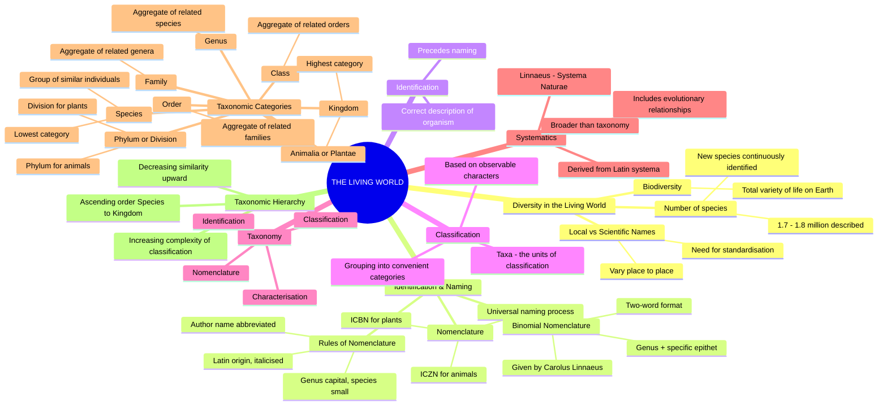
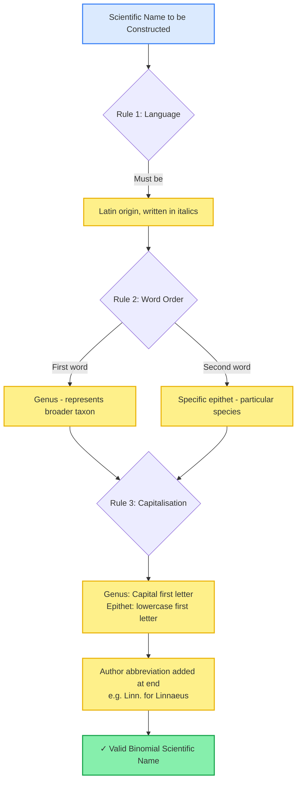
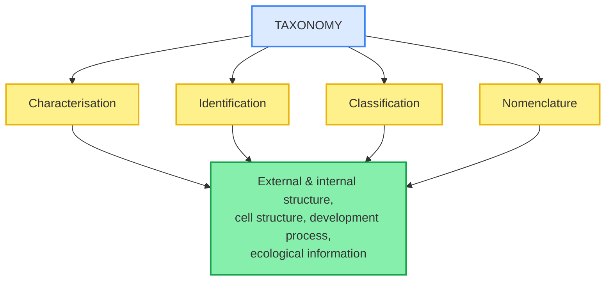
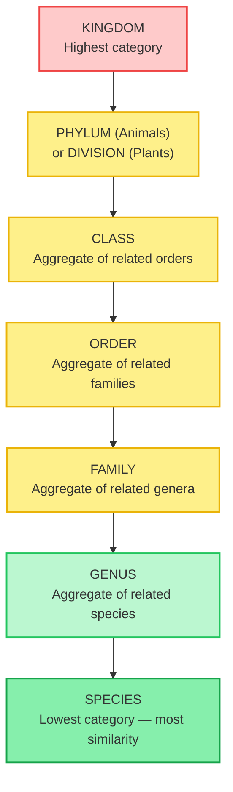

# 🧬 BIOLOGY XI — THE LIVING WORLD

### *Comprehensive Theory Notes | NCERT Chapter 1 | Board + NEET-UG Integrated*

---

## 🗺️ THE CHAPTER DASHBOARD

> Use this mind-map as your cognitive anchor. Before reading a single subsection below, trace every branch here once. This is the entire chapter compressed into one visual.

---

## 1.1 DIVERSITY IN THE LIVING WORLD

The living world is staggering in its variety. From potted plants on a windowsill to organisms invisible to the naked eye, every distinct kind of organism you observe represents a **species** — the fundamental unit of biological diversity.

> [!info] Quantifying Biodiversity (NCERT Anchor Fact)
> The number of species that are known and described on Earth currently ranges between **1.7 to 1.8 million**. This number represents only the *documented* diversity — taxonomists continuously discover and describe new organisms even today, both in unexplored regions and in previously studied ones.

**Why naming matters — the core problem:**

Local names for the same organism vary drastically from region to region, even within a single country. This creates communicative chaos among scientists. The solution required two sequential processes:

1. **Identification** — correctly describing an organism so that we know precisely *which* organism we are referring to.
2. **Nomenclature** — assigning a single, standardised scientific name to that identified organism, accepted by biologists worldwide.

### 1.1.1 The Governing Codes of Nomenclature

Scientific naming is not arbitrary — it follows internationally agreed-upon legal codes so that **each organism receives exactly one valid name**, and that name is never reused for any other organism.

| Feature / Parameter | **ICBN** (Botanical)                    | **ICZN** (Zoological)                   |
| ------------------- | --------------------------------------------- | --------------------------------------------- |
| Full Form           | International Code for Botanical Nomenclature | International Code of Zoological Nomenclature |
| Governs             | Plants, algae, fungi                          | Animals                                       |
| Founding Principle  | Agreed botanical naming criteria              | Agreed zoological naming criteria             |
| Outcome             | One universally accepted plant name           | One universally accepted animal name          |

> [!warning] CRITICAL PITFALL: ICBN vs ICZN Confusion
> A very frequent NEET distractor swaps these two codes. Remember: **B**otanical → Plants (ICB**N**), **Z**oological → Animals (ICZ**N**). Do not assume a single universal naming code governs all life — plants and animals are regulated by **separate** international codes.

### 1.1.2 Binomial Nomenclature — The Two-Word System

> [!info] Carolus Linnaeus — Father of Binomial Nomenclature
> The system of providing a scientific name composed of exactly two components — the **Generic name** and the **specific epithet** — is called **Binomial Nomenclature**. This naming convention was introduced by **Carolus Linnaeus** and is practised by biologists across the globe to this day. Linnaeus titled his own foundational publication *Systema Naturae*.

**Worked Example — Mango:**

$$
\underbrace{\textit{Mangifera}}_{\text{Genus}}\ \underbrace{\textit{indica}}_{\text{Specific Epithet}}
$$

This binomial name, when the author is cited, is written in full as: *Mangifera indica* Linn. — indicating Linnaeus first described this species.

> [!warning] CRITICAL PITFALL: The Four Inviolable Rules of Biological Nomenclature
> NEET frequently tests violations of these exact rules through "spot the error" questions:
>
> 1. Biological names are generally in **Latin** and written in *italics*. They are Latinised even if derived from another language.
> 2. The **first word** denotes the **Genus**; the **second word** denotes the **specific epithet**.
> 3. When **handwritten**, both words must be separately **underlined** (since italics cannot be rendered by hand); when printed, they appear in *italics*.
> 4. The genus name begins with a **capital letter**; the specific epithet begins with a **small (lowercase) letter** — even if it is derived from a proper noun.
>
> A name written as "*Mangifera Indica*" (capital I in indica) is **incorrect** — this is a direct NCERT exercise trap (Exercise Q5).

> [!example] NCERT MANDATORY EXAMPLES: Correctly Formatted Binomial Names
> Memorise these exact NCERT-cited binomials with zero spelling deviation:
>
> - *Mangifera indica* (Mango)
> - *Homo sapiens* (Human being)
> - *Panthera leo* (Lion)
> - *Solanum tuberosum* (Potato)
> - *Musca domestica* (Housefly)
> - *Triticum aestivum* (Wheat)

---

## 1.2 CLASSIFICATION, TAXONOMY, AND SYSTEMATICS

Since it is virtually impossible to study every individual living organism on Earth, biologists devised **classification** — the grouping of organisms into convenient categories based on easily observable, shared characteristics.

> [!info] Taxa — The Building Blocks of Classification
> The scientific term for these classification categories is **taxa** (singular: **taxon**). Taxa exist at vastly different hierarchical levels — "Animals," "Mammals," and "Dogs" are all valid taxa, but they represent progressively narrower and more specific levels of grouping. A taxon is a real, distinct biological entity — not merely a morphological convenience.

### 1.2.1 Defining Taxonomy

**Taxonomy** is the branch of biology dealing with the *characterisation*, *identification*, *classification*, and *nomenclature* of organisms.

### 1.2.2 Defining Systematics — The Broader Discipline

> [!info] Etymology and Scope of Systematics
> The word **systematics** derives from the Latin word *systema*, meaning systematic arrangement of organisms — the very term Linnaeus used as the title of his work, *Systema Naturae*. Systematics was historically focused on identifying diversity and relationships among organisms, and its scope was later enlarged to also include identification, nomenclature, and classification. Critically, **systematics takes into account evolutionary relationships between organisms** — a dimension that simple taxonomy does not inherently require.

> [!warning] CRITICAL PITFALL: Taxonomy ≠ Systematics
> Students frequently treat these terms as perfect synonyms in NEET MCQs. While they overlap heavily in modern usage, the NCERT text draws a precise distinction: **Systematics explicitly incorporates evolutionary relationships**, broadening it beyond pure classification, identification, and naming (which is the narrower definition of taxonomy).

---

## 1.3 TAXONOMIC CATEGORIES — THE HIERARCHY OF CLASSIFICATION

Classification is **not a single-step process** — it involves a hierarchy of sequential steps, where each step represents a distinct rank or **taxonomic category**. All categories together constitute the **taxonomic hierarchy**.

> [!warning] CRITICAL PITFALL: The Direction of the Hierarchy
> As you ascend the hierarchy from **Species → Kingdom**, the number of **shared characteristics decreases**. Conversely, the lower the taxon, the **greater** the number of characteristics members share. Higher categories are progressively harder to relate to other taxa at the same level — making classification problems more complex as you move upward. NEET frequently inverts this logic in assertion-reasoning questions.

### 1.3.1 Species — The Foundational Unit

A **species** is a group of individual organisms with fundamental similarities, distinguishable from other closely related species by distinct morphological differences. All organisms — plant or animal — share **species** as their lowest taxonomic category.

> [!example] NCERT MANDATORY EXAMPLES: Species-Level Distinctions
>
> - *Mangifera indica*, *Solanum tuberosum* (potato), and *Panthera leo* (lion) — the species names *indica*, *tuberosum*, and *leo* are specific epithets.
> - *Panthera* additionally has the specific epithet *tigris* (tiger).
> - *Solanum* additionally includes species *nigrum* and *melongena* (brinjal).
> - Humans belong to species **sapiens**, grouped in genus **Homo** → *Homo sapiens*.

### 1.3.2 Genus

A **genus** comprises a group of **related species** sharing more characteristics with each other than with species of other genera — essentially, genera are aggregates of closely related species.

> [!example] NCERT MANDATORY EXAMPLES: Genus-Level Grouping
>
> - **Potato** and **brinjal** are different species but share the same genus: *Solanum*.
> - **Lion** (*Panthera leo*), **leopard** (*P. pardus*), and **tiger** (*P. tigris*) are all species of genus **Panthera**.
> - The genus *Panthera* differs from genus **Felis**, which includes cats.

### 1.3.3 Family

**Family** is a group of related genera with fewer shared similarities compared to genus or species. Families are characterised using **both vegetative and reproductive features** in plants.

> [!example] NCERT MANDATORY EXAMPLES: Family-Level Grouping
>
> - Genera *Solanum*, *Petunia*, and *Datura* are placed together in family **Solanaceae**.
> - Genus *Panthera* (lion, tiger, leopard) is placed with genus *Felis* (cats) in family **Felidae**.
> - Cats and dogs, despite some similarities, belong to two separate families: **Felidae** and **Canidae** respectively.

### 1.3.4 Order

**Order** is a higher category formed by an assemblage of **families** that exhibit a few similar characters — fewer in number than the similarities found between genera within a single family.

> [!example] NCERT MANDATORY EXAMPLES: Order-Level Grouping
>
> - Plant families **Convolvulaceae** and **Solanaceae** are included in order **Polymoniales**, based mainly on floral characters.
> - The animal order **Carnivora** includes families **Felidae** and **Canidae**.

### 1.3.5 Class

**Class** includes related orders.

> [!example] NCERT MANDATORY EXAMPLES: Class-Level Grouping
>
> - Order **Primata** (monkey, gorilla, gibbon) is placed in class **Mammalia** alongside order **Carnivora** (tiger, cat, dog).

### 1.3.6 Phylum / Division

Classes comprising fishes, amphibians, reptiles, birds, and mammals together constitute the next higher category, **Phylum**.

> [!warning] CRITICAL PITFALL: Phylum vs Division — Kingdom-Specific Terminology
> This is one of the **highest-yield NEET traps** in this chapter. The taxonomic rank above Class is called:
>
> - **Phylum** — used exclusively for the **Animal Kingdom**
> - **Division** — used exclusively for the **Plant Kingdom**
>
> Never interchange these terms across kingdoms in an exam answer.

> [!example] NCERT MANDATORY EXAMPLES: Phylum-Level Grouping
>
> - Classes Pisces, Amphibia, Reptilia, Aves, and Mammalia are united in phylum **Chordata**, based on shared features such as the presence of a **notochord** and a **dorsal hollow neural system**.

### 1.3.7 Kingdom

**Kingdom** is the highest taxonomic category.

> [!example] NCERT MANDATORY EXAMPLES: Kingdom-Level Grouping
>
> - All animal phyla are assigned to **Kingdom Animalia**.
> - All plant divisions are assigned to **Kingdom Plantae**.

---

## 1.4 THE COMPLETE TAXONOMIC HIERARCHY TABLE (NCERT Table 1.1)

This exact table appears in the NCERT textbook and is one of the **highest-yield direct-recall assets** in the entire chapter. Memorise every cell.

| Common Name        | Biological Name       | Genus         | Family        | Order      | Class           | Phylum / Division |
| ------------------ | --------------------- | ------------- | ------------- | ---------- | --------------- | ----------------- |
| **Man**      | *Homo sapiens*      | *Homo*      | Hominidae     | Primata    | Mammalia        | Chordata          |
| **Housefly** | *Musca domestica*   | *Musca*     | Muscidae      | Diptera    | Insecta         | Arthropoda        |
| **Mango**    | *Mangifera indica*  | *Mangifera* | Anacardiaceae | Sapindales | Dicotyledonae   | Angiospermae      |
| **Wheat**    | *Triticum aestivum* | *Triticum*  | Poaceae       | Poales     | Monocotyledonae | Angiospermae      |

> [!warning] CRITICAL PITFALL: Reading the Table Correctly
> Notice that **Mango** and **Wheat** share the same Phylum/Division (**Angiospermae**) but diverge sharply at the **Class** level (**Dicotyledonae** vs **Monocotyledonae**). This demonstrates the chapter's core principle: similarity decreases sharply as you ascend levels of higher-order classification, even within the same major plant group.

---

## 📌 CHAPTER SYNTHESIS

The living world's staggering diversity (1.7–1.8 million described species) necessitated standardised systems of **identification**, **nomenclature** (governed by ICBN for plants and ICZN for animals, using Linnaeus's **binomial nomenclature**), and **classification**. These four processes collectively define **taxonomy**, while **systematics** extends this further by incorporating evolutionary relationships. Classification operates through a nested hierarchy of **taxonomic categories** — Species, Genus, Family, Order, Class, Phylum/Division, and Kingdom — where similarity decreases and classification complexity increases as one ascends the hierarchy.
