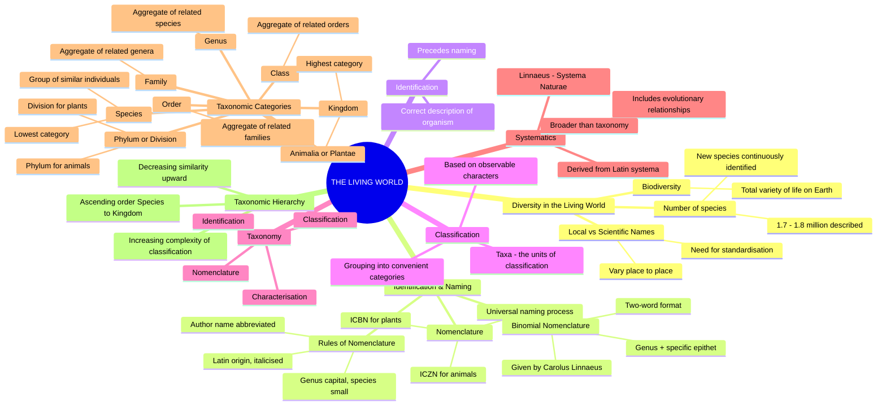
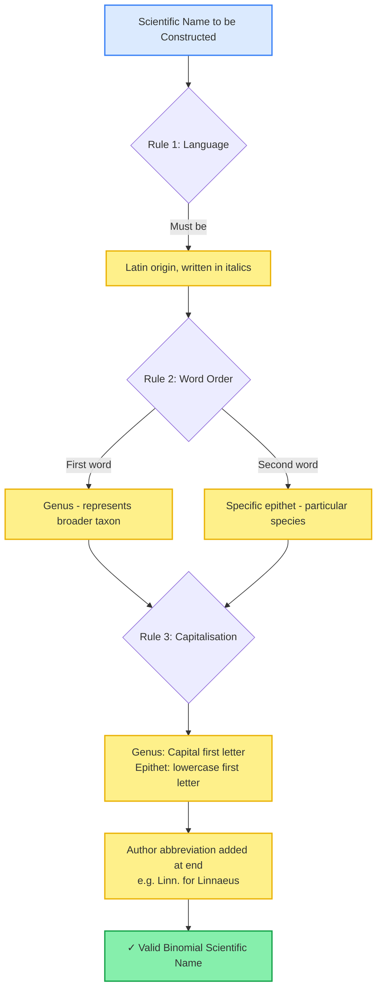
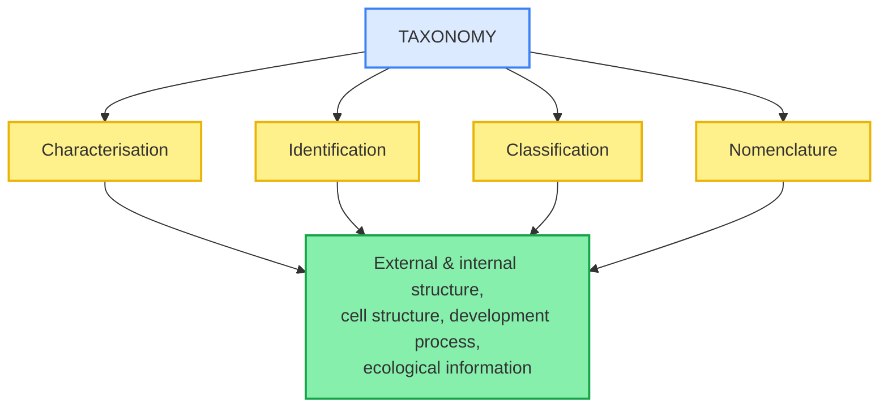
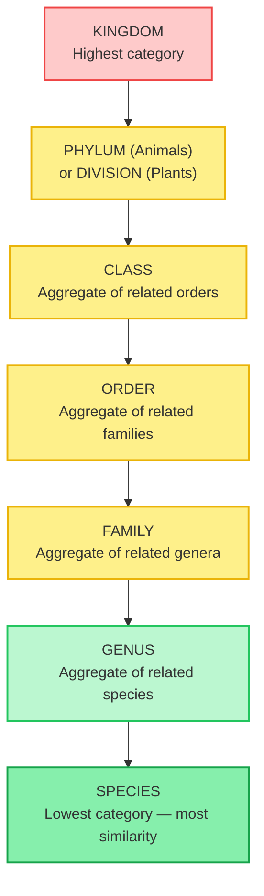

# 🧬 BIOLOGY XI — THE LIVING WORLD
### *Comprehensive Theory Notes | NCERT Chapter 1 | Board + NEET-UG Integrated*
### *Written so a complete first-time reader and a final-revision NEET aspirant get equal value from every line*

---

## 🗺️ THE CHAPTER DASHBOARD

> Use this mind-map as your cognitive anchor (a fixed mental reference point you keep returning to). Trace every branch here once before reading a single subsection below. This is the entire chapter compressed into one visual.

---

## 0. WHY DOES THIS CHAPTER EXIST? (The Motivation, in Plain Words)

Before any rule or definition, understand the *problem* this chapter solves — definitions stick far better once you know why they were invented.

Imagine you are a botanist (a scientist who studies plants) in India, and a colleague in Brazil is studying the exact same plant. In your village it might be called by one local name; in Brazil, by a completely different local name; and in a third country, by yet another. If you both publish papers using only your local names, nobody reading both papers would realise you are talking about the *same organism*. Science cannot progress like this — communication would collapse into confusion.

So humanity needed two sequential fixes, and this entire chapter is essentially about those two fixes plus the bookkeeping system built around them:

1. **Identification** (the act of correctly describing an organism's features so you know precisely *which* organism you mean) — you must first pin down exactly what you are looking at.
2. **Nomenclature** (the act of giving that identified organism one single, universally accepted scientific name) — only once identification is settled can a permanent, unambiguous name be assigned.

Once millions of organisms each have a unique identity and name, you still face a second, separate problem: how do you *organise* 1.7–1.8 million named things so the human mind can study them without being overwhelmed? That second problem is solved by **classification** (the grouping of organisms into convenient, manageable categories based on shared, observable features) — and classification is what gives rise to the **taxonomic hierarchy** you will spend most of this chapter mastering.

---

## 1.1 DIVERSITY IN THE LIVING WORLD

The living world is staggering (overwhelmingly vast) in its variety. From the potted plant on your windowsill to organisms invisible to the naked eye, every distinct *kind* of organism you can observe represents a **species** (Latin *species* = kind/sort) — the fundamental, smallest meaningful unit of biological diversity. You will meet this word constantly, so lock in this working definition now: a species is a group of organisms similar enough to each other, and different enough from every other group, to be called one "kind" of living thing.

> [!info] Quantifying Biodiversity (NCERT Anchor Fact)
> **Biodiversity** (the total variety of life forms present on Earth, *bios* = life + *diversitas* = variety) currently includes between **1.7 to 1.8 million** species that are formally known and described. This number represents only the *documented* diversity — taxonomists (scientists who classify and name organisms) continuously discover and describe new organisms even today, both in unexplored regions of the planet and, surprisingly, in regions that have already been studied for decades.

**Why naming matters — restating the core problem precisely:**

Local names for the very same organism vary drastically from region to region, even within a single country, let alone across the globe. This creates communicative chaos (a breakdown in mutual understanding) among scientists who need to be certain they're discussing the same organism. The solution, as introduced above, required two sequential processes:

1. **Identification** — correctly describing an organism so we know precisely *which* organism is being referenced.
2. **Nomenclature** (Latin *nomen* = name + *calare* = to call) — assigning a single, standardised scientific name to that identified organism, a name accepted by biologists worldwide regardless of their native language.

### 1.1.1 The Governing Codes of Nomenclature

Scientific naming is not arbitrary (random or whimsical) — it follows internationally agreed-upon legal codes (rulebooks with the force of scientific convention) so that **each organism receives exactly one valid name**, and that exact name is never legitimately reused for any other organism on Earth.

| Feature / Parameter | **ICBN** (Botanical Code) | **ICZN** (Zoological Code) |
|---|---|---|
| Full Form | International Code for Botanical Nomenclature | International Code of Zoological Nomenclature |
| Governs | Plants, algae, fungi | Animals |
| Founding Principle | Agreed botanical (plant-related) naming criteria | Agreed zoological (animal-related) naming criteria |
| Outcome | One universally accepted plant name | One universally accepted animal name |

> [!warning] CRITICAL PITFALL: ICBN vs ICZN Confusion
> A very frequent NEET distractor (a wrong option deliberately designed to look correct) swaps these two codes. Memory hook: **B**otanical → Plants → ICB**N**; **Z**oological → Animals → ICZ**N**. Do not assume a single universal naming code governs all life forms — plants and animals are regulated by two entirely **separate** international codes, each with its own committee and rulebook.

### 1.1.2 Binomial Nomenclature — The Two-Word System

> [!info] Carolus Linnaeus — Father of Binomial Nomenclature
> The system of providing a scientific name composed of exactly two components — the **Generic name** (the genus, denoting the broader group an organism belongs to) and the **specific epithet** (Latin *species* = kind + Greek *epitheton* = something added/attributed, denoting the particular species within that genus) — is called **Binomial Nomenclature** (*bi* = two + *nomen* = name). This naming convention was introduced by the Swedish naturalist **Carolus Linnaeus**, and it is practised by biologists across the globe to this very day, over 250 years after he proposed it. Linnaeus titled his own foundational publication *Systema Naturae* ("The System of Nature").

**Worked Example — Mango:**

$$\underbrace{\textit{Mangifera}}_{\text{Genus}}\ \underbrace{\textit{indica}}_{\text{Specific Epithet}}$$

This binomial name, when the author (the scientist who first formally described and named the species) is cited, is written in full as: *Mangifera indica* Linn. — the abbreviation "Linn." indicating Linnaeus was the first to formally describe this exact species.

> [!warning] CRITICAL PITFALL: The Four Inviolable Rules of Biological Nomenclature
> NEET frequently tests violations of these exact rules through "spot the error" questions. Treat these as non-negotiable laws, not casual style suggestions:
> 1. **Language rule:** Biological names are generally in **Latin** and written in *italics*. Even names derived from other languages (e.g., a person's surname, or a local word) are first Latinised (converted into a Latin-sounding form) before being used.
> 2. **Word-order rule:** The **first word** denotes the **Genus** (the broader taxonomic group); the **second word** denotes the **specific epithet** (the narrower, species-specific identifier).
> 3. **Handwriting rule:** When **handwritten**, both words must be separately **underlined** (since italics cannot be physically rendered by hand); when printed, they appear in *italics* instead of being underlined.
> 4. **Capitalisation rule:** The genus name begins with a **capital letter**; the specific epithet begins with a **small (lowercase) letter** — this holds true even if the epithet is derived from a proper noun (e.g., a person's name).
>
> A name written as "*Mangifera Indica*" (with a capital I in indica) is **incorrect** — this is a direct, frequently repeated NCERT exercise trap (Exercise Q5 in the textbook).

> [!example] NCERT MANDATORY EXAMPLES: Correctly Formatted Binomial Names
> Memorise these exact NCERT-cited binomials with zero spelling deviation — these are the highest-probability "write the scientific name of..." answers in both Board and NEET papers:
> - *Mangifera indica* (Mango)
> - *Homo sapiens* (Human being)
> - *Panthera leo* (Lion)
> - *Solanum tuberosum* (Potato)
> - *Musca domestica* (Housefly)
> - *Triticum aestivum* (Wheat)

---

## 1.2 CLASSIFICATION, TAXONOMY, AND SYSTEMATICS

Since it is practically impossible for any single biologist to study every individual living organism on Earth one-by-one, biologists devised **classification** (*classis* = division + *facere* = to make) — the grouping of organisms into convenient, manageable categories based on easily observable, shared characteristics. Instead of dealing with 1.7 million unrelated facts, you deal with a handful of organised groups.

> [!info] Taxa — The Building Blocks of Classification
> The scientific term for each of these classification categories is a **taxon** (plural: **taxa**; Greek *taxis* = arrangement). Taxa exist at vastly different hierarchical levels — "Animals," "Mammals," and "Dogs" are all valid taxa, but they represent progressively narrower and more specific levels of grouping as you go from the first to the last. Importantly, a taxon is treated as a real, distinct biological entity with genuine shared ancestry and features — not merely a convenient bucket invented for human bookkeeping.

### 1.2.1 Defining Taxonomy

**Taxonomy** (Greek *taxis* = arrangement + *nomos* = law/method) is the branch of biology dealing with four sequential activities: the *characterisation* (describing distinguishing features), *identification*, *classification*, and *nomenclature* of organisms.

### 1.2.2 Defining Systematics — The Broader Discipline

> [!info] Etymology and Scope of Systematics
> The word **systematics** derives from the Latin word *systema*, meaning "systematic arrangement of organisms" — this is the very same root Linnaeus used as the title of his work, *Systema Naturae*. Systematics was historically focused narrowly on identifying diversity and relationships among organisms; its scope was later enlarged (broadened over time) to also include identification, nomenclature, and classification, essentially absorbing all of taxonomy's job description and then adding one more dimension. That extra dimension is critical: **systematics explicitly takes into account evolutionary relationships between organisms** (i.e., who evolved from whom, and how closely related different groups are by descent) — a dimension that bare taxonomy does not inherently require you to consider.

> [!warning] CRITICAL PITFALL: Taxonomy ≠ Systematics
> Students frequently treat these two terms as perfect synonyms in NEET MCQs, and lose marks for it. While the two overlap heavily in everyday usage, the NCERT text draws a precise distinction: **Systematics explicitly incorporates evolutionary relationships**, which makes it broader than taxonomy's narrower definition (classification, identification, and naming only, without a mandatory evolutionary lens).

---

## 1.3 TAXONOMIC CATEGORIES — THE HIERARCHY OF CLASSIFICATION

Classification is **not a single-step process** — it unfolds as a hierarchy (a ranked, ordered series of levels) of sequential steps, where each step represents a distinct rank, or **taxonomic category**. All categories taken together constitute the **taxonomic hierarchy** — think of it as a ladder with seven main rungs.

> [!warning] CRITICAL PITFALL: The Direction of the Hierarchy
> As you ascend (move upward) the hierarchy from **Species → Kingdom**, the number of **shared characteristics decreases** at every step. Conversely, the lower the taxon (the closer to Species), the **greater** the number of characteristics its members share with each other. This also means higher categories are progressively harder to neatly relate to other taxa at the same level, making classification decisions more complex the further up you go. NEET frequently inverts this logic in assertion-reasoning questions, so read the direction of any such question twice.

### 1.3.1 Species — The Foundational Unit

A **species** is a group of individual organisms with fundamental similarities, distinguishable (able to be told apart) from other closely related species by distinct morphological differences (differences in external form and structure). Every organism — whether plant or animal — shares **species** as its lowest, most specific taxonomic category.

> [!example] NCERT MANDATORY EXAMPLES: Species-Level Distinctions
> - *Mangifera indica*, *Solanum tuberosum* (potato), and *Panthera leo* (lion) — here the species names *indica*, *tuberosum*, and *leo* are the specific epithets.
> - *Panthera* additionally has the specific epithet *tigris* (tiger).
> - *Solanum* additionally includes the species *nigrum* and *melongena* (brinjal/eggplant).
> - Humans belong to the species **sapiens**, grouped within the genus **Homo** → giving the full binomial *Homo sapiens*.

### 1.3.2 Genus

A **genus** (Latin *genus* = birth, origin, kind; plural: **genera**) comprises a group of **related species** that share more characteristics with each other than they do with species belonging to other genera — in short, a genus is an aggregate (collection) of closely related species.

> [!example] NCERT MANDATORY EXAMPLES: Genus-Level Grouping
> - **Potato** and **brinjal** are different species, but they share the same genus: *Solanum*.
> - **Lion** (*Panthera leo*), **leopard** (*P. pardus*), and **tiger** (*P. tigris*) are all different species belonging to the same genus, **Panthera**.
> - The genus *Panthera* is distinct from the genus **Felis**, which includes domestic and small wild cats.

### 1.3.3 Family

**Family** is a group of related genera, sharing fewer similarities compared to what you find at the genus or species level. In plants specifically, families are characterised using **both vegetative (non-reproductive, e.g., leaves/stems) and reproductive (e.g., flower/fruit) features**.

> [!example] NCERT MANDATORY EXAMPLES: Family-Level Grouping
> - The genera *Solanum*, *Petunia*, and *Datura* are placed together in the family **Solanaceae**.
> - The genus *Panthera* (lion, tiger, leopard) is placed alongside the genus *Felis* (cats) in the family **Felidae**.
> - Cats and dogs, despite sharing some superficial similarities, actually belong to two entirely separate families: **Felidae** and **Canidae** respectively.

### 1.3.4 Order

**Order** (Latin *ordo* = row, rank, arrangement) is a higher category formed by an assemblage (gathering) of **families** that exhibit a few similar characters — fewer in number than the similarities you would find between genera grouped within a single family.

> [!example] NCERT MANDATORY EXAMPLES: Order-Level Grouping
> - The plant families **Convolvulaceae** and **Solanaceae** are both included in the order **Polymoniales**, grouped together mainly on the basis of floral (flower-related) characters.
> - The animal order **Carnivora** includes both the families **Felidae** and **Canidae**.

### 1.3.5 Class

**Class** (Latin *classis* = division, group) includes a set of related orders grouped together.

> [!example] NCERT MANDATORY EXAMPLES: Class-Level Grouping
> - The order **Primata** (containing monkey, gorilla, gibbon) is placed in the class **Mammalia** alongside the order **Carnivora** (containing tiger, cat, dog).

### 1.3.6 Phylum / Division

The classes comprising fishes, amphibians, reptiles, birds, and mammals together constitute the next higher category, called **Phylum** (Greek *phylon* = race, tribe, stock).

> [!warning] CRITICAL PITFALL: Phylum vs Division — Kingdom-Specific Terminology
> This is one of the **highest-yield NEET traps** in the entire chapter. The taxonomic rank that sits directly above Class is called by two *different* names depending on which kingdom you're in:
> - **Phylum** — used exclusively for the **Animal Kingdom**.
> - **Division** — used exclusively for the **Plant Kingdom**.
>
> Never interchange these two terms across kingdoms in an exam answer; doing so is treated as a factual error, not a stylistic one.

> [!example] NCERT MANDATORY EXAMPLES: Phylum-Level Grouping
> - The classes Pisces (fish), Amphibia, Reptilia, Aves (birds), and Mammalia are all united under the phylum **Chordata**, based on shared diagnostic features such as the presence of a **notochord** (a flexible rod-shaped support structure running along the back) and a **dorsal hollow neural system** (a hollow nerve tube running along the back).

### 1.3.7 Kingdom

**Kingdom** is the highest and broadest taxonomic category of all.

> [!example] NCERT MANDATORY EXAMPLES: Kingdom-Level Grouping
> - All animal phyla collectively are assigned to **Kingdom Animalia**.
> - All plant divisions collectively are assigned to **Kingdom Plantae**.

---

## 1.4 THE COMPLETE TAXONOMIC HIERARCHY TABLE (NCERT Table 1.1)

This exact table appears in the NCERT textbook and is one of the **highest-yield direct-recall assets** in the entire chapter — examiners frequently ask you to fill in a blank cell or two from memory. Memorise every cell exactly as written.

| Common Name | Biological Name | Genus | Family | Order | Class | Phylum / Division |
|---|---|---|---|---|---|---|
| **Man** | *Homo sapiens* | *Homo* | Hominidae | Primata | Mammalia | Chordata |
| **Housefly** | *Musca domestica* | *Musca* | Muscidae | Diptera | Insecta | Arthropoda |
| **Mango** | *Mangifera indica* | *Mangifera* | Anacardiaceae | Sapindales | Dicotyledonae | Angiospermae |
| **Wheat** | *Triticum aestivum* | *Triticum* | Poaceae | Poales | Monocotyledonae | Angiospermae |

> [!warning] CRITICAL PITFALL: Reading the Table Correctly
> Notice that **Mango** and **Wheat** share the exact same Phylum/Division (**Angiospermae**, the flowering plants) but diverge sharply once you move to the **Class** level (**Dicotyledonae** vs **Monocotyledonae**). This single observation demonstrates the chapter's core principle in miniature: similarity decreases sharply as you ascend levels of higher-order classification, even between organisms that still share a major group at the broadest level.

---

## 📌 CHAPTER SYNTHESIS

The living world's staggering diversity (1.7–1.8 million described species) necessitated (made absolutely necessary) standardised systems of **identification**, **nomenclature** (governed by ICBN for plants and ICZN for animals, and built on Linnaeus's **binomial nomenclature**), and **classification**. These four linked processes — characterisation, identification, classification, and nomenclature — collectively define **taxonomy**, while **systematics** extends this further by deliberately incorporating evolutionary relationships into the picture. Classification itself operates through a nested hierarchy of **taxonomic categories** — Species, Genus, Family, Order, Class, Phylum/Division, and Kingdom — where similarity steadily decreases and classification complexity steadily increases as one climbs the hierarchy from Species toward Kingdom.

---

## 🧭 HOW TO USE THIS FILE FOR MAXIMUM EFFICIENCY

Read this NOTES file once slowly for full understanding of *why* each rule and rank exists — don't skim. Once the logic is internalised, switch to the GLOSSARY file to drill exact term-by-term recall, then the REVISION_MINDMAPS file for rapid 48-hour-before-exam scanning, and finally the PQs file to actively test yourself under exam-like conditions rather than just re-reading passively.
