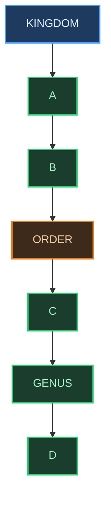

# ✍️ BIOLOGY XI — THE LIVING WORLD

### *Practice Question Bank | Board Tier + NEET-UG Tier | Active Recall Edition*

> Attempt every question **before** opening the answer key at the bottom. Active recall (forcing your brain to retrieve an answer rather than re-reading it) builds far stronger exam memory than passive review.

---

## 🟢 BOARD LEVEL (TIER 1)

### Section A — Diagram-Based Labelling

**Q1.** Study the partially-labelled taxonomic hierarchy flowchart below and identify the structures marked **A, B, C,** and  **D** .

Identify A, B, C, and D, and state one example organism's correct value for each blank using the Man/Housefly/Mango/Wheat data table.

---

### Section B — Difference-Based Descriptive Questions

**Q2.** Differentiate between **Phylum** and  **Division** , with one suitable example of each.

**Q3.** Differentiate between **Taxonomy** and  **Systematics** , clearly stating the one additional dimension systematics includes.

**Q4.** Differentiate between **ICBN** and **ICZN** in terms of full form and the kingdom each governs.

**Q5.** Differentiate between **Genus** and  **Species** , using the genus *Panthera* as your worked example.

**Q6.** Differentiate between **Identification** and  **Nomenclature** , clearly stating which process must logically precede the other.

---

### Section C — Definition Questions (NCERT-Precise Wording Expected)

**Q7.** Define Taxonomy.

**Q8.** Define Systematics.

**Q9.** Define Species.

**Q10.** Define Binomial Nomenclature, naming the scientist who introduced it.

**Q11.** Define a Taxon, and state one example each from the plant and animal kingdoms.

---

## 🟡 NEET LEVEL (TIER 2)

### Section D — Assertion-Reasoning (A–R) Matrix

For each question, choose the correct option:
**(a)** Both A and R are true, and R is the correct explanation of A.
**(b)** Both A and R are true, but R is NOT the correct explanation of A.
**(c)** A is true, but R is false.
**(d)** A is false, but R is true.

**Q12.**
**Assertion (A):** Systematics is broader in scope than taxonomy.
**Reason (R):** Systematics includes the study of evolutionary relationships among organisms, in addition to identification, nomenclature, and classification.

**Q13.**
**Assertion (A):** Phylum is used as the rank above Class for plants, while Division is used for animals.
**Reason (R):** Both Phylum and Division occupy the exact same position in the taxonomic hierarchy, directly above Class.

**Q14.**
**Assertion (A):** All species placed within the genus *Panthera* share more characteristics with each other than with species of the genus  *Felis* .
**Reason (R):** A genus is, by definition, an aggregate of closely related species that resemble one another more than they resemble species belonging to other genera.

**Q15.**
**Assertion (A):** Mango and wheat belong to two different plant divisions.
**Reason (R):** Mango is classified under class Dicotyledonae, while wheat is classified under class Monocotyledonae.

---

### Section E — Statement Evaluation

**Q16.** Consider the following statements and determine how many of them are  **correct** :
I. The number of formally described species on Earth currently ranges between 1.7 and 1.8 million.
II. The ICZN governs the naming of plants, algae, and fungi.
III. Binomial nomenclature was introduced by Carolus Linnaeus.
IV. A taxon can exist only at the species level of the taxonomic hierarchy.

Options: (a) Only one (b) Exactly two (c) Exactly three (d) All four

**Q17.** Consider the following statements regarding the taxonomic hierarchy and determine how many of them are  **incorrect** :
I. As one moves from Species towards Kingdom, the number of shared characteristics increases.
II. Family is characterised in plants using both vegetative and reproductive features.
III. The order Carnivora includes the families Felidae and Canidae.
IV. Class Mammalia includes the orders Primata and Carnivora.

Options: (a) Only one (b) Exactly two (c) Exactly three (d) None

---

### Section F — Match the Following

**Q18.** Match Column I (Common Name) with Column II (Genus) and Column III (Family). Each item in Column I matches exactly one item in Column II and one in Column III.

| Column I (Common Name) | Column II (Genus) | Column III (Family) |
| ---------------------- | ----------------- | ------------------- |
| (i) Man                | (P)*Musca*      | (1) Poaceae         |
| (ii) Housefly          | (Q)*Triticum*   | (2) Hominidae       |
| (iii) Mango            | (R)*Homo*       | (3) Anacardiaceae   |
| (iv) Wheat             | (S)*Mangifera*  | (4) Muscidae        |

---

### Section G — Hierarchy Logic Questions (in place of numericals, since this chapter has no quantitative formulae)

**Q19.** If Kingdom is numbered rank 1 and Species is numbered rank 7 within the standard 7-rank taxonomic hierarchy, what rank number corresponds to Family?

**Q20.** How many distinct taxonomic ranks lie strictly between Class and Species (not counting Class or Species themselves)? Name them in descending order.

---

<b>Click to Reveal Complete Explanatory Answer Key</b>

**Q1.** A = Phylum/Division, B = Class, C = Family, D = Species. Worked example (Man): A = Chordata, B = Mammalia, C = Hominidae, D = sapiens (i.e., the species  *Homo sapiens* ).

**Q2.** Phylum is used exclusively for the Animal Kingdom (e.g., Chordata, uniting Pisces through Mammalia on the basis of notochord and dorsal hollow neural system); Division is used exclusively for the Plant Kingdom (e.g., Angiospermae, uniting Dicotyledonae and Monocotyledonae). Both occupy the identical position in the hierarchy, directly above Class — only the kingdom-specific name differs.

**Q3.** Taxonomy is the branch of biology dealing with characterisation, identification, classification, and nomenclature of organisms. Systematics covers all of this too, but additionally and explicitly incorporates evolutionary relationships between organisms, making it the broader of the two disciplines.

**Q4.** ICBN = International Code for Botanical Nomenclature, governing plants, algae, and fungi. ICZN = International Code of Zoological Nomenclature, governing animals. Each ensures one universally accepted name per organism within its respective kingdom.

**Q5.** Genus is a taxonomic category comprising a group of related species (e.g., *Panthera* contains the species  *leo* ,  *tigris* , and  *pardus* ). Species is the lowest taxonomic category, representing one specific kind of organism distinguishable from all others by morphological differences (e.g., *Panthera leo* is one single species within the genus  *Panthera* ).

**Q6.** Identification is the process of correctly describing an organism so it can be matched to a known taxon. Nomenclature is the subsequent process of assigning that identified organism a single, standardised scientific name. Identification must always precede nomenclature — you cannot name what you have not yet correctly identified.

**Q7.** Taxonomy is the branch of biology dealing with the characterisation, identification, classification, and nomenclature of organisms.

**Q8.** Systematics is the branch of study concerned with identification, nomenclature, classification, and the evolutionary relationships between organisms — broader than taxonomy because of the added evolutionary dimension.

**Q9.** A species is a group of individual organisms with fundamental similarities, distinguishable from other closely related species by distinct morphological differences.

**Q10.** Binomial nomenclature is the system of providing a scientific name composed of exactly two words — the genus and the specific epithet — introduced by Carolus Linnaeus.

**Q11.** A taxon is a unit or category of biological classification, such as a Kingdom, Phylum, Class, or any other rank in the hierarchy. Plant example: Division Angiospermae. Animal example: Phylum Chordata.

**Q12.** Answer: (a). Both statements are true, and the Reason directly explains why systematics is the broader discipline — the inclusion of evolutionary relationships is precisely what extends its scope beyond taxonomy.

**Q13.** Answer: (d). The Assertion is false — it has the kingdoms swapped; the correct rule is Phylum for animals and Division for plants, not the reverse. The Reason is true on its own: Phylum and Division do occupy the identical position in the hierarchy, directly above Class. This question is a classic NEET trap testing whether you notice a reversed kingdom-rank claim even when a true, plausible-sounding Reason follows it.

**Q14.** Answer: (a). Both are true; the Reason (genus = aggregate of closely related, mutually similar species) is exactly why the Assertion's specific example holds for *Panthera* versus  *Felis* .

**Q15.** Answer: (d). The Assertion is false — mango and wheat both belong to the same Division, Angiospermae. The Reason is true: mango is indeed Dicotyledonae and wheat is indeed Monocotyledonae, but this is a Class-level distinction within the same Division, not a Division-level one.

**Q16.** Answer: (b) Exactly two. Statements I and III are correct. Statement II is incorrect (ICZN governs animals, not plants — ICBN governs plants). Statement IV is incorrect (a taxon exists at every rank of the hierarchy, not species alone).

**Q17.** Answer: (a) Only one. Statement I is incorrect (shared characteristics decrease, not increase, as you move from Species towards Kingdom). Statements II, III, and IV are all correct as per NCERT examples.

**Q18.** (i)-R-(2), (ii)-P-(4), (iii)-S-(3), (iv)-Q-(1). That is: Man– *Homo* –Hominidae; Housefly– *Musca* –Muscidae; Mango– *Mangifera* –Anacardiaceae; Wheat– *Triticum* –Poaceae.

**Q19.** Rank 5. Sequence: Kingdom(1) → Phylum/Division(2) → Class(3) → Order(4) → Family(5) → Genus(6) → Species(7).

**Q20.** Three ranks lie strictly between Class and Species: Order, Family, and Genus (in descending order from Class towards Species).

