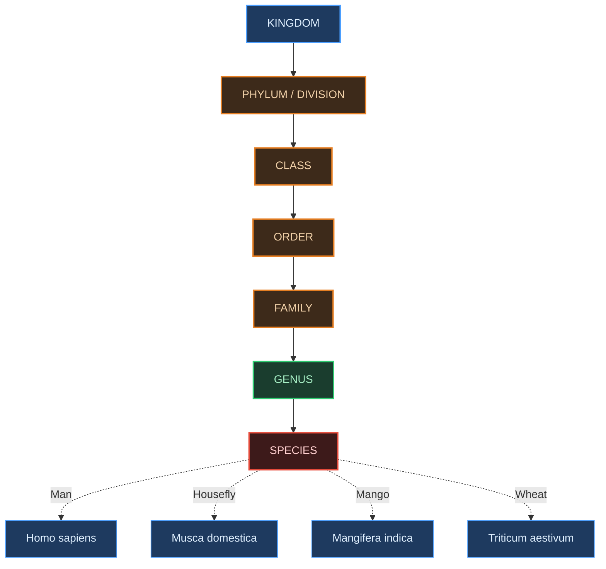
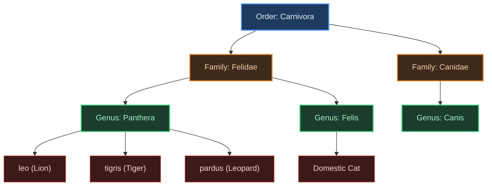

# ⚡ BIOLOGY XI — THE LIVING WORLD

### *48-Hour Rapid Revision Vault | Pure Visual + Tabular Format*

---

## 🔁 COMPARATIVE MATRIX 1: Taxonomy vs. Systematics

| Feature / Parameter of Comparison | **Taxonomy**                                             | **Systematics**                                       |
| --------------------------------- | -------------------------------------------------------------- | ----------------------------------------------------------- |
| Etymological Root                 | Greek*taxis*(arrangement) +*nomos*(law)                    | Latin*systema*(systematic arrangement)                    |
| Core Processes Included           | Characterisation, Identification, Classification, Nomenclature | All of taxonomy's processes**+ evolutionary relationships** |
| Evolutionary Relationships        | **Not inherently included**                              | **Explicitly included**                               |
| Scope                             | Narrower                                                       | **Broader**— historically enlarged in definition     |
| Coined / Popularised Via          | General classification practice                                | Linnaeus's*Systema Naturae*                               |
| NEET Exam Weight                  | Moderate                                                       | **High**— frequently confused with taxonomy          |

---

## 🔁 COMPARATIVE MATRIX 2: ICBN vs. ICZN

| Feature / Parameter of Comparison | **ICBN**                                | **ICZN**                                |
| --------------------------------- | --------------------------------------------- | --------------------------------------------- |
| Full Form                         | International Code for Botanical Nomenclature | International Code of Zoological Nomenclature |
| Kingdom Governed                  | **Plantae**(plants, algae, fungi)       | **Animalia**(animals)                   |
| Naming Authority Type             | Botanical taxonomists                         | Zoological taxonomists                        |
| Goal                              | One universally accepted name per plant       | One universally accepted name per animal      |
| Common NEET Trap                  | Mixing up which code governs which kingdom    | Mixing up which code governs which kingdom    |

---

## 🔁 COMPARATIVE MATRIX 3: Phylum vs. Division

| Feature / Parameter of Comparison | **Phylum**                                      | **Division**                                   |
| --------------------------------- | ----------------------------------------------------- | ---------------------------------------------------- |
| Kingdom Applicability             | **Animal Kingdom only**                         | **Plant Kingdom only**                         |
| Position in Hierarchy             | Above Class, below Kingdom                            | Above Class, below Kingdom                           |
| NCERT Example                     | Chordata (unites Pisces → Mammalia)                  | Angiospermae (unites Dicotyledonae, Monocotyledonae) |
| Defining Shared Feature           | Notochord, dorsal hollow neural system (for Chordata) | Reproductive/vegetative structural commonalities     |

---

## 🌳 TAXONOMIC HIERARCHY TREE — Mermaid Classification Map

---

## 📊 MASTER RECALL TABLE — NCERT Table 1.1 (Memorise Exactly)

| Common Name        | Biological Name       | Genus         | Family                  | Order                | Class                     | Phylum/Division        |
| ------------------ | --------------------- | ------------- | ----------------------- | -------------------- | ------------------------- | ---------------------- |
| **Man**      | *Homo sapiens*      | *Homo*      | **Hominidae**     | **Primata**    | **Mammalia**        | **Chordata**     |
| **Housefly** | *Musca domestica*   | *Musca*     | **Muscidae**      | **Diptera**    | **Insecta**         | **Arthropoda**   |
| **Mango**    | *Mangifera indica*  | *Mangifera* | **Anacardiaceae** | **Sapindales** | **Dicotyledonae**   | **Angiospermae** |
| **Wheat**    | *Triticum aestivum* | *Triticum*  | **Poaceae**       | **Poales**     | **Monocotyledonae** | **Angiospermae** |

---

## 🐱 GENUS-FAMILY QUICK MAP — Cats vs Dogs

---

## 🧠 MNEMONIC VAULT

> [!note] MNEMONIC: Taxonomic Hierarchy (Kingdom → Species)
> **K**eep **P**onds **C**lean **O**r **F**rogs **G**et **S**ick
> → **K**ingdom, **P**hylum/Division, **C**lass, **O**rder, **F**amily, **G**enus, **S**pecies

> [!note] MNEMONIC: The 4 Pillars of Taxonomy
> **C-I-C-N** : "**C**ats **I**dentify **C**ute **N**ames"
> → **C**haracterisation, **I**dentification, **C**lassification, **N**omenclature

> [!note] MNEMONIC: Rules of Binomial Nomenclature
> "**L**ittle **G**enus **C**aps, **S**mall **S**pecies" (mnemonic for the 4 rules)
> → **L**atin + italics, **G**enus first word, **C**apital for genus, **S**mall letter for **S**pecies epithet

> [!note] MNEMONIC: Phylum vs Division Memory Hook
> "**A**nimals get **P**hylum, **P**lants get **D**ivision" — both start differently (Animal-Phylum, Plant-Division) so they can never be swapped if you remember the **A-P / P-D** pairing.

> [!note] MNEMONIC: ICBN vs ICZN Memory Hook
> "**B**otany **B**efore **Z**oology, alphabetically" — **B** comes before  **Z** , and **B**otanical (ICBN) is listed before **Z**oological (ICZN) for the exact same reason plants are studied before animals in most Indian textbook sequences.

---

## 🚫 COMMON WRONG-ANSWER TRAP TABLE

| What students mistakenly write       | Why it's wrong                      | The correct version                                 |
| ------------------------------------ | ----------------------------------- | --------------------------------------------------- |
| *Mangifera Indica*                 | Specific epithet capitalised        | *Mangifera indica*(lowercase i)                   |
| ICZN governs plants                  | Codes are swapped                   | ICBN → plants, ICZN → animals                     |
| "Phylum Angiospermae"                | Wrong rank-word for plants          | "**Division**Angiospermae"                    |
| "Division Chordata"                  | Wrong rank-word for animals         | "**Phylum**Chordata"                          |
| Taxonomy = Systematics               | Treated as identical                | Systematics**adds**evolutionary relationships |
| Higher taxon = more shared features  | Direction reversed                  | Higher taxon =**fewer**shared features        |
| *Homo Sapiens sapiens*style errors | Random capitalisation in trinomials | Only the genus word is capitalised                  |

---

## ⚡ QUICK-SCAN FLASHCARD TABLE

| #  | Fact                                                                                   | Tag   |
| -- | -------------------------------------------------------------------------------------- | ----- |
| 1  | Total described species range:**1.7 – 1.8 million**                             | Board |
| 2  | Binomial Nomenclature given by**Carolus Linnaeus**                               | Both  |
| 3  | Plants governed by**ICBN** ; Animals governed by**ICZN**                   | NEET  |
| 4  | Genus = capital first letter; Species epithet = small first letter                     | Board |
| 5  | *Mangifera Indica*is **WRONG** ;*Mangifera indica*is correct                 | NEET  |
| 6  | Systematics includes**evolutionary relationships** ; Taxonomy alone does not     | NEET  |
| 7  | Phylum used for**Animals** ; Division used for**Plants**                   | NEET  |
| 8  | Chordata's defining features:**notochord**+**dorsal hollow neural system** | NEET  |
| 9  | *Panthera* : lion ( *leo* ), tiger ( *tigris* ), leopard ( *pardus* )          | Both  |
| 10 | Mango and Wheat share Division**Angiospermae**but differ at**Class**level  | NEET  |
| 11 | Felidae (cats) and Canidae (dogs) both sit under Order**Carnivora**              | NEET  |
| 12 | Order**Primata**+ Order**Carnivora**both sit under Class**Mammalia** | Board |
